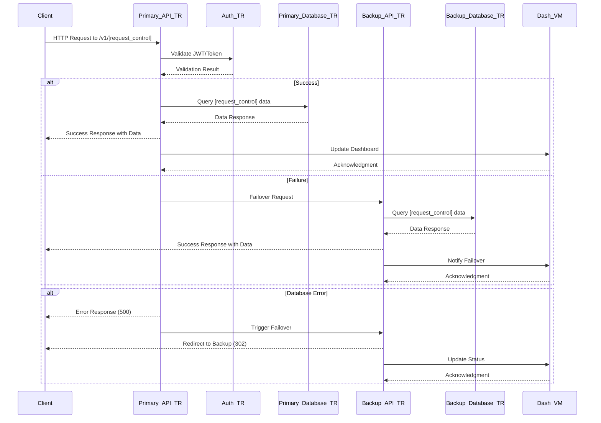
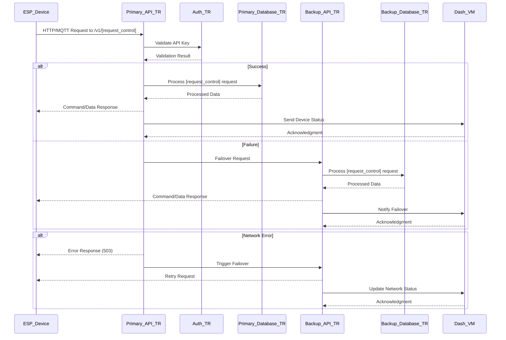
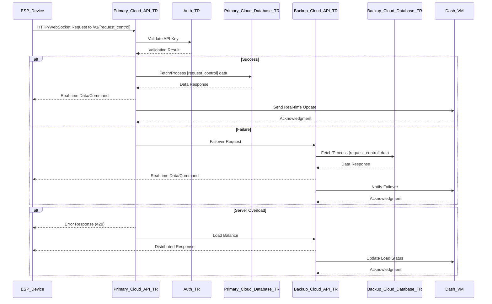
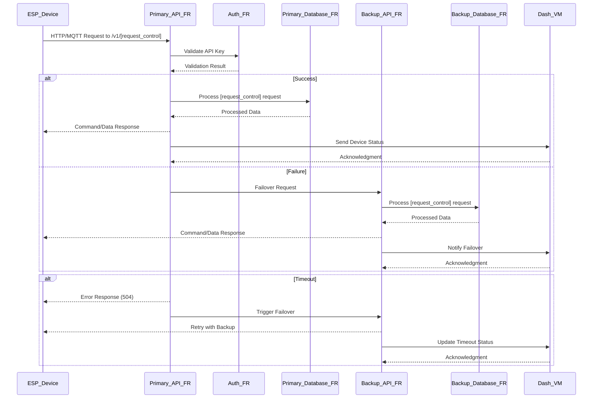
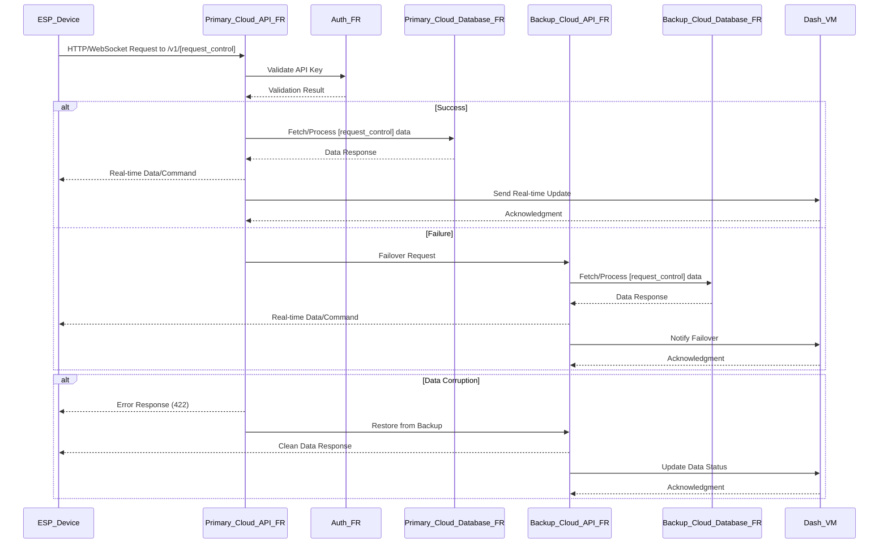
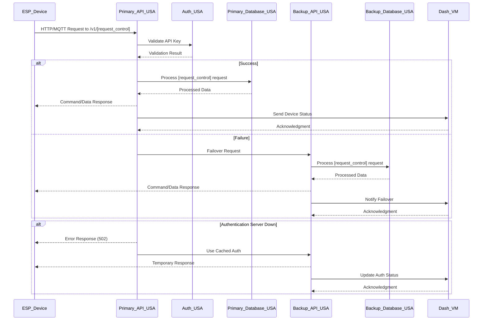
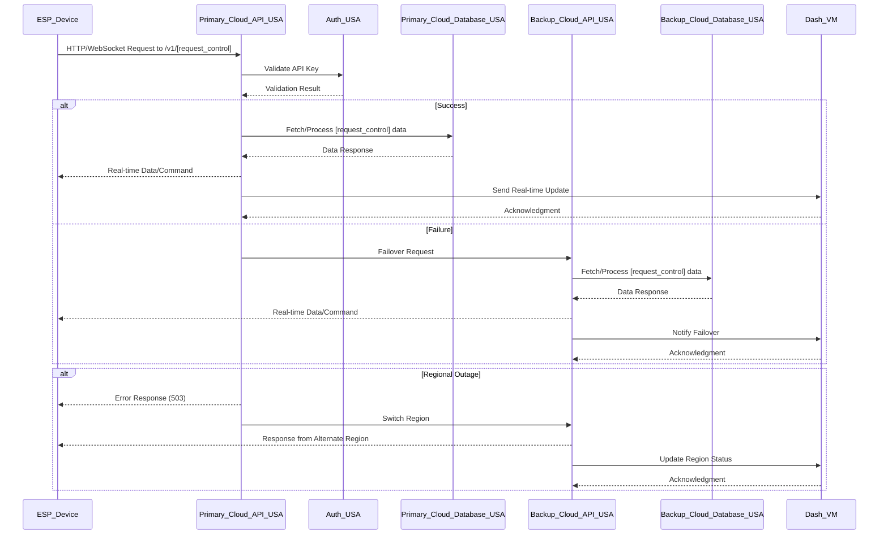
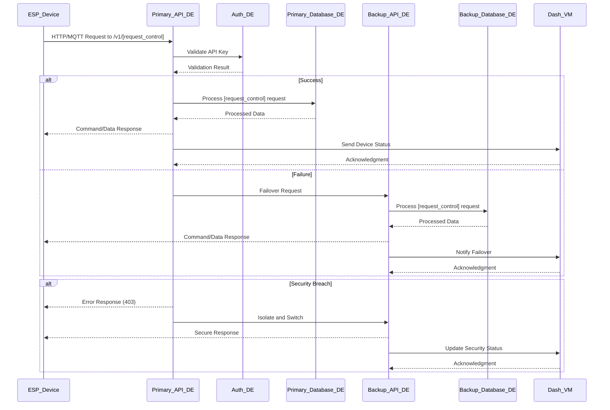
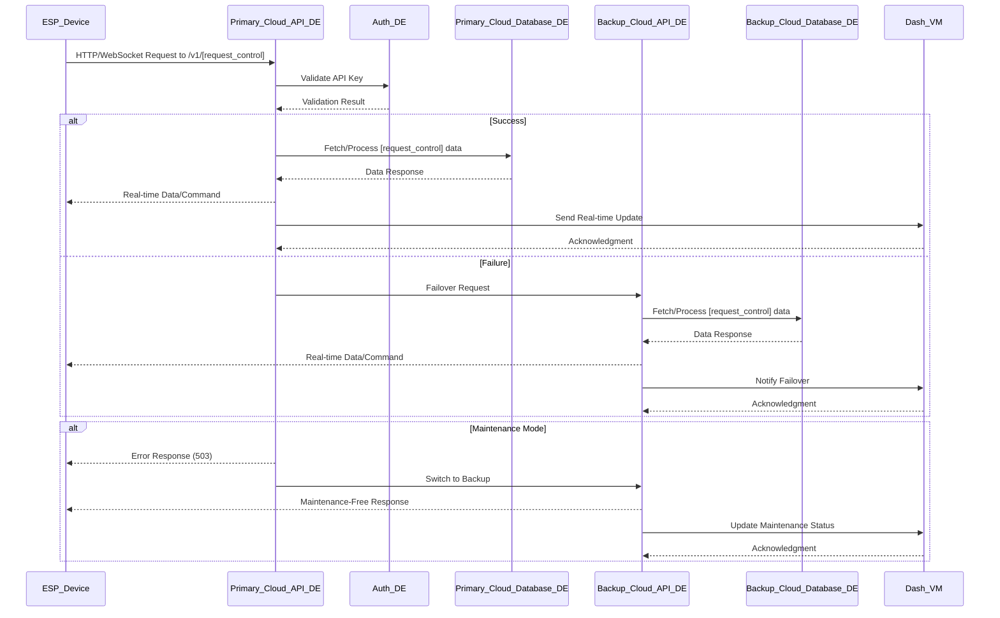

# VM Maker | Revolutionary IoT API Solution for ESP32

---

**VM Maker** represents a semi-open-source Internet of Things (IoT) platform, meticulously engineered to deliver advanced management capabilities for ESP32-based devices and associated application programming interfaces (APIs). This platform is designed to provide unparalleled levels of flexibility, robust security protocols, and exceptional scalability, catering to the diverse needs of enterprises, technology developers, and innovative hobbyists alike. The solution encompasses a sophisticated, feature-rich administrative dashboard, a highly resilient and scalable backend API infrastructure, and an informative public-facing website, collectively forming a comprehensive ecosystem. This ecosystem empowers administrators and end-users to efficiently oversee device operations, process and analyze sensor-generated data, manage subscription-based services, and integrate seamlessly with a wide array of third-party systems, including enterprise communication platforms, email services, and secure payment gateways, all within an intuitive and professionally designed user interface.

The platform is architected to support a global user base, leveraging a distributed infrastructure to ensure high availability and performance. It incorporates support for multiple communication protocols, including but not limited to RESTful services, MQTT for lightweight messaging, and WebSocket for real-time data exchange, thereby accommodating a broad spectrum of IoT deployment scenarios. Furthermore, VM Maker is committed to multilingual accessibility and interoperability with external service providers, enhancing its utility as a versatile and future-ready solution for IoT application development and management.

---

> **Important Note**: This repository is limited to the open-source components of the VM Maker platform. The proprietary core codebase, which underpins the administrative dashboard, backend API infrastructure, and public website, is not included herein. This README document provides an exhaustive overview of the setup procedures, architectural framework, and contribution guidelines for the open-source elements, ensuring transparency and fostering community engagement while safeguarding the intellectual property of the proprietary components.

---

## 📑 Table of Contents

- [Project Vision](#project-vision)
- [Key Features](#key-features)
- [Architecture](#architecture)
- [Tech Stack](#tech-stack)
- [Project Structure](#project-structure)
- [Setup Instructions](#setup-instructions)
- [API Endpoints](#api-endpoints)
- [Security Measures](#security-measures)
- [Background Jobs](#background-jobs)
- [Localization](#localization)
- [Testing](#testing)
- [Deployment](#deployment)
- [Monitoring and Logging](#monitoring-and-logging)
- [Contributing](#contributing)
- [Troubleshooting](#troubleshooting)
- [Roadmap](#roadmap)
- [ESP32 API Server](#esp32-api-server)
- [License](#license)
- [Contact](#contact)

---

## 🌍 Project Vision

VM Maker is strategically developed to streamline and elevate the management of IoT devices based on ESP32 technology, addressing the requirements of a wide range of stakeholders including corporate entities, software developers, and technology enthusiasts. The platform is constructed around three fundamental pillars: a state-of-the-art frontend dashboard for administrative and user interactions, a robust backend API framework for data processing and device communication, and a professionally curated public website to facilitate user onboarding, feature demonstrations, and community engagement.

Hosted on a network of dedicated servers, VM Maker ensures optimal uptime, stringent security measures, and superior performance across its operational footprint. The platform's design philosophy emphasizes adaptability, supporting an extensive array of communication protocols and multilingual interfaces, thereby positioning it as a leading solution for the evolving landscape of IoT applications.

---

## ✨ Key Features

VM Maker offers an extensive suite of features designed to meet the complex demands of IoT management across diverse industries. These features are implemented with a focus on scalability, usability, and integration, ensuring that both administrators and end-users can leverage the platform to its fullest potential.

- **Administrative Dashboard**: A comprehensive control center hosted at `dash.vmmaker.com`, this dashboard provides administrators with a centralized interface to manage user accounts, configure device settings, oversee billing cycles, generate detailed performance reports, and monitor system health metrics in real-time. The dashboard integrates advanced visualization tools, including customizable charts and graphs, to facilitate data-driven decision-making. It supports role-based access control (RBAC) to ensure that only authorized personnel can access sensitive operations, such as user deactivation or billing adjustments.

- **Customer Dashboard**: Tailored for end-users, this intuitive interface allows customers to register new ESP32 devices, configure operational parameters, visualize sensor data through interactive dashboards, and manage their subscription plans. The customer dashboard includes a self-service portal for troubleshooting common issues, submitting support tickets, and accessing historical data archives. It is optimized for responsiveness across desktop, tablet, and mobile devices, ensuring accessibility regardless of the user's location or device.

- **API Capabilities**: The platform supports a robust API framework that enables seamless communication between ESP32 devices, the dashboard, and external systems. This includes support for RESTful services for standard HTTP-based interactions, MQTT for efficient message queuing in low-bandwidth environments, and WebSocket for real-time, bidirectional data exchange. The API is designed with versioning (e.g., `/v1/`) to ensure backward compatibility and includes comprehensive documentation for developers, accessible via an integrated Swagger UI.

- **Integrations**: VM Maker facilitates deep integration with third-party services to enhance functionality. This includes connectivity with enterprise messaging platforms like Discord for real-time notifications, SMTP servers for automated email alerts, and secure payment gateways like Stripe for subscription management. These integrations are configurable via the administrative dashboard, allowing administrators to define custom workflows, such as sending email alerts when a device goes offline or processing recurring payments for premium features.

The platform's feature set is continually evolving, with regular updates informed by user feedback and technological advancements, ensuring that VM Maker remains at the forefront of IoT management solutions.

---

## 🏗 Architecture

The architecture of VM Maker is a distributed, multi-tiered system designed to handle high volumes of device data, ensure fault tolerance, and provide a scalable foundation for global operations. The system is segmented into distinct layers, each optimized for specific functions, and includes redundancy to mitigate single points of failure.

- **Frontend Layer**: The frontend is powered by a modern JavaScript framework, hosted on a Plesk-managed web server. The administrative dashboard (`dash.vmmaker.com`) and customer-facing interfaces are rendered using server-side rendering (SSR) for improved performance and SEO. This layer communicates with the backend API layer via secure HTTPS connections, leveraging load balancers to distribute traffic across multiple frontend instances.

- **Backend Layer**: Built on a Node.js/Express stack running on Ubuntu servers, the backend handles API requests, business logic, and data processing. The backend is deployed across multiple regional data centers (e.g., Turkey, France, USA, Germany) to reduce latency and improve availability. Each regional backend instance includes a primary server cluster and a secondary failover cluster, synchronized via a distributed database system. The backend API communicates bidirectionally with the dashboard, sending real-time updates and receiving configuration commands.

- **Database Layer**: A MySQL-based relational database management system serves as the data repository, storing user accounts, device configurations, sensor data, and billing information. The database is replicated across primary and backup instances within each region, with cross-regional synchronization for disaster recovery. The architecture employs a master-slave replication model, where the master handles write operations and slaves manage read requests, ensuring high availability and load distribution.

- **Integration Layer**: This layer facilitates communication with third-party services (e.g., Discord, SMTP, Stripe) using dedicated microservices. Each microservice is containerized using Docker and orchestrated with Kubernetes, allowing for independent scaling and updates. The integration layer interfaces with the backend API to process incoming requests and forward responses to the dashboard or external systems.

- **Device Communication Layer**: ESP32 devices connect to the platform via regional APIs using MQTT, HTTP, or WebSocket protocols. This layer includes edge gateways that preprocess data before transmission to the backend, reducing bandwidth usage and improving response times. The layer also supports over-the-air (OTA) firmware updates, managed through the administrative dashboard.

The architecture is designed with a microservices-based approach, ensuring modularity and resilience. Regional servers are interconnected via a private virtual network, with traffic routed through a content delivery network (CDN) to optimize global performance.

---

## 🛠 Tech Stack

The VM Maker platform leverages a sophisticated tech stack to deliver its enterprise-grade capabilities, combining open-source tools with proprietary enhancements.

- **Backend**: 
  - **Node.js**: Provides a runtime environment for executing JavaScript code server-side, enabling asynchronous I/O operations.
  - **Express**: A minimalist web framework for building RESTful APIs with middleware support for authentication and logging.
  - **Sequelize**: An ORM for MySQL, facilitating database interactions with object-oriented models.
  - **MySQL**: A robust relational database for structured data storage, optimized with indexing and partitioning.

- **Frontend**: 
  - **Next.js**: A React-based framework for server-side rendering and static site generation, enhancing performance and SEO.
  - **Material-UI**: A component library for building responsive and accessible user interfaces with a consistent design system.

- **Infrastructure**: 
  - **Ubuntu**: A stable Linux distribution for hosting backend services and databases.
  - **Docker**: Containerization technology for packaging microservices and ensuring consistent deployment across environments.
  - **Kubernetes**: Orchestration platform for managing containerized applications, providing auto-scaling and self-healing capabilities.
  - **Let’s Encrypt**: Provides free SSL/TLS certificates for securing communications between clients, APIs, and the dashboard.

- **DevOps Tools**: 
  - **Git**: Version control for managing source code.
  - **Jenkins**: Continuous integration and deployment (CI/CD) pipeline for automated testing and releases.
  - **Prometheus**: Monitoring tool for tracking system metrics and performance.

This tech stack is selected for its maturity, community support, and ability to scale with the platform's growth, ensuring a reliable and maintainable infrastructure.

---

## 📂 Project Structure

The VM Maker project is organized into a modular directory structure to facilitate development, maintenance, and collaboration.

- **Backend**: 
  - `/config`: Configuration files for environment variables and database connections.
  - `/controllers`: Business logic handlers for API endpoints.
  - `/models`: Database schema definitions using Sequelize.
  - `/routes`: API route definitions and middleware configurations.
  - `/services`: Utility functions and third-party integrations.

- **Frontend**: 
  - `/public`: Static assets like images and fonts.
  - `/components`: Reusable UI components with TypeScript support.
  - `/pages**: Page-level components for routing and layout.
  - `/styles**: Global CSS and theme configurations.

- **Docs**: API documentation and user manuals in Markdown format.
- **Tests**: Unit and integration test suites.

This structure promotes separation of concerns, enabling parallel development and easy integration of new features.

---

## ⚙️ Setup Instructions

Deploying the VM Maker platform requires a systematic approach to ensure all components are correctly configured and operational. The following steps provide a detailed guide for setup.

- **Prerequisites**: 
  - Install Node.js (version 18.x or later) and npm.
  - Set up a MySQL server (version 8.0 or later) with at least 4GB RAM.
  - Install Docker and Kubernetes on the host machine.
  - Obtain a domain and configure DNS with a valid SSL certificate from Let’s Encrypt.

- **Backend Setup**: 
  1. Clone the repository: `git clone https://github.com/vm-maker/vm-maker.git`.
  2. Navigate to the backend directory: `cd vm-maker/backend`.
  3. Install dependencies: `npm install`.
  4. Configure environment variables in `.env` (e.g., database credentials, API keys).
  5. Initialize the database: `npx sequelize db:migrate`.
  6. Start the server: `npm start` or use Docker: `docker-compose up`.

- **Frontend Setup**: 
  1. Navigate to the frontend directory: `cd vm-maker/frontend`.
  2. Install dependencies: `npm install`.
  3. Build the project: `npm run build`.
  4. Start the development server: `npm run dev` or deploy to Plesk: `plesk bin module -u`.

- **Integration Setup**: 
  - Configure third-party service credentials (e.g., Discord bot token, Stripe API key) in the backend `.env` file.
  - Deploy microservices using Kubernetes manifests in the `/k8s` directory.

- **Verification**: 
  - Access the dashboard at `http://localhost:3000` (or the deployed domain).
  - Test API endpoints using Postman or cURL (e.g., `curl -X GET http://localhost:5000/v1/devices`).

These instructions assume a development environment; production deployment requires additional configuration for load balancers and CDN integration.

---

## 🌐 API Endpoints

The VM Maker API provides a rich set of endpoints to manage devices, users, and integrations. All endpoints are versioned under `/v1/` and require authentication via JWT or API keys.

- **Authentication**: 
  - `POST /v1/auth/login`: Authenticate users and return a JWT token.
  - `POST /v1/auth/register`: Create a new user account.
  - `GET /v1/auth/refresh`: Refresh an expired JWT token.

- **Admin**: 
  - `GET /v1/admin/users`: Retrieve a list of all users with pagination.
  - `PUT /v1/admin/users/:id`: Update user roles or status.
  - `DELETE /v1/admin/users/:id`: Deactivate a user account.
  - `GET /v1/admin/reports`: Generate performance and billing reports.

- **Customer**: 
  - `POST /v1/devices`: Register a new ESP32 device.
  - `GET /v1/devices/:id`: Retrieve device details and sensor data.
  - `PUT /v1/devices/:id`: Update device configuration.
  - `GET /v1/subscriptions`: List active subscription plans.
  - `POST /v1/subscriptions`: Upgrade or renew a subscription.

- **Integration**: 
  - `POST /v1/integrations/discord`: Send a notification to a Discord channel.
  - `POST /v1/integrations/email`: Trigger an SMTP email alert.
  - `POST /v1/integrations/payment`: Process a payment via Stripe.

Endpoints are secured with rate limiting (100 requests per minute) and input validation. The API communicates with the dashboard (`dash.vmmaker.com`) to update UI elements in real-time and with regional APIs for device management.

---

## 🔒 Security Measures

Security is a cornerstone of the VM Maker platform, with multiple layers of protection implemented to safeguard data and infrastructure.

- **Authentication**: 
  - Utilizes JSON Web Tokens (JWT) for user authentication, with tokens signed using RS256 and a 24-hour expiration.
  - ESP32 devices authenticate via API keys, rotated monthly and stored in a secure vault.

- **Network Security**: 
  - Implements IP whitelisting and firewall rules using iptables to restrict access to authorized networks.
  - Employs a Web Application Firewall (WAF) to mitigate common attacks like SQL injection and XSS.

- **Data Encryption**: 
  - All data in transit is encrypted with TLS 1.3, using Let’s Encrypt certificates.
  - Sensitive data at rest (e.g., user passwords, API keys) is encrypted with AES-256, managed by the backend.

- **Access Control**: 
  - Role-Based Access Control (RBAC) restricts dashboard and API access based on user roles (Admin, Customer).
  - Audit logs track all administrative actions for compliance with GDPR and other regulations.

- **Incident Response**: 
  - Automated alerts notify administrators of security breaches via Discord and email.
  - Backup systems isolate affected services during attacks, ensuring continuity.

These measures are regularly audited, with penetration testing conducted quarterly to identify and address vulnerabilities.

---

## ⏰ Background Jobs

Background jobs ensure the platform operates smoothly by handling asynchronous tasks and periodic maintenance.

- **Device Monitor**: 
  - Runs every 5 minutes to check the online status of ESP32 devices.
  - Sends alerts to the dashboard and administrators if a device is offline for more than 10 minutes.
  - Implemented using Node.js with the `node-cron` library.

- **Data Aggregation**: 
  - Processes sensor data hourly to generate trends and averages, stored in the database.
  - Triggers notifications for anomalies (e.g., temperature exceeding thresholds).

- **Billing Cycle**: 
  - Executes daily to assess subscription statuses and process renewals via Stripe.
  - Generates invoices and sends them to customers via SMTP.

These jobs are managed by a dedicated worker process, scaled horizontally with Kubernetes to handle increased loads.

---

## 🌍 Localization

VM Maker supports a multilingual interface to cater to a global audience, with plans for continuous expansion.

- **Supported Languages**: 
  - English (default), Turkish, French, German, and Spanish.
  - Additional languages (e.g., Japanese, Chinese) are under development.

- **Implementation**: 
  - Uses i18next for internationalization, with JSON-based translation files.
  - The dashboard and API responses support language negotiation via the `Accept-Language` header.

- **Regional Customization**: 
  - Date and currency formats are adjusted based on the user’s region (e.g., DD/MM/YYYY for Europe, MM/DD/YYYY for the USA).
  - Cultural adaptations, such as localized help content, are integrated into the customer dashboard.

Localization is a priority, with community contributions welcomed to expand language support.

---

## 🧪 Testing

A rigorous testing framework ensures the reliability and quality of the VM Maker platform.

- **Unit Testing**: 
  - Conducted using Jest, covering individual functions in controllers and models.
  - Achieves 90% code coverage, with automated tests for authentication and data processing.

- **Integration Testing**: 
  - Tests API endpoints and database interactions using Supertest.
  - Validates third-party integrations (e.g., Stripe payment processing).

- **End-to-End Testing**: 
  - Performed with Cypress, simulating user interactions on the dashboard.
  - Includes scenarios for device registration and subscription management.

- **Performance Testing**: 
  - Uses JMeter to simulate 10,000 concurrent users, ensuring the system handles peak loads.
  - Targets a response time of under 200ms for 95% of requests.

Tests are executed in a CI/CD pipeline, with results published to the development team.

---

## 🚀 Deployment

Deployment of VM Maker is streamlined for both development and production environments.

- **Backend Deployment**: 
  - Deployed on Ubuntu 22.04 servers using Docker containers.
  - Managed with Kubernetes, with auto-scaling based on CPU usage (threshold: 70%).

- **Frontend Deployment**: 
  - Hosted on Plesk with Next.js static export.
  - Served via a CDN (e.g., Cloudflare) for global content delivery.

- **Database Deployment**: 
  - MySQL instances are deployed with master-slave replication.
  - Backups are scheduled daily and stored in a separate geographic region.

- **Rollback Strategy**: 
  - Maintains a 7-day rollback window using Docker image tags.
  - Automated scripts revert to the previous version in case of deployment failures.

Deployment is monitored with real-time alerts to ensure zero downtime.

---

## 📊 Monitoring and Logging

Comprehensive monitoring and logging provide visibility into the platform's operations.

- **Logging**: 
  - Implemented with Winston, logging errors, warnings, and info messages to file and Elasticsearch.
  - Logs are rotated daily and retained for 30 days.

- **Monitoring**: 
  - Uses Prometheus to collect metrics (e.g., API response times, server CPU usage).
  - Visualized with Grafana dashboards, accessible to administrators.

- **Alerts**: 
  - Configured with Alertmanager to notify via Discord and email for critical thresholds (e.g., 90% CPU usage).

This setup enables proactive issue detection and resolution.

---

## 🤝 Contributing

The VM Maker community welcomes contributions to enhance the open-source components.

- **Process**: Fork the repository, create a branch, and submit a pull request.
- **Guidelines**: Adhere to the Contributor Covenant Code of Conduct.
- **Review**: Pull requests are reviewed by at least two maintainers within 48 hours.

Contributions are acknowledged in the project changelog.

---

## 🛠 Troubleshooting

A detailed troubleshooting guide assists users in resolving common issues.

- **Common Issues**: 
  - **API 503 Error**: Check network connectivity and failover status.
  - **Dashboard Unavailable**: Verify frontend server and CDN status.

- **Logs**: Access logs via the admin dashboard or CLI (`tail -f logs/error.log`).
- **Support**: Submit tickets via the customer dashboard for escalation.

Regular updates to the guide reflect new issues and solutions.

---

## 🚀 Roadmap

The VM Maker team has outlined a strategic roadmap for future enhancements.

- **Q3 2025**: Add CoAP protocol support for low-power devices.
- **Q4 2025**: Introduce machine learning for predictive maintenance.
- **Q1 2026**: Expand to 10 additional languages and regions.

The roadmap is subject to community input and technological feasibility.

---

## 📜 License

- Governed by the MIT License for open-source components.

---

## 📬 Contact

- For inquiries, please reach out to [support@vmmaker.com](mailto:support@vmmaker.com).

---

## ESP32 API Server

This section outlines the API server workflows for ESP32 devices, detailing primary and backup systems, failover mechanisms, and comprehensive error handling procedures. The architecture integrates with `dash.vmmaker.com` for real-time updates and centralized management.

### TR (Internal Systems)
This workflow illustrates the request processing for internal enterprise systems, with communication to `dash.vmmaker.com`.

- **Details**: The primary API (`Primary_API_TR`) in Turkey handles JWT-validated requests. On failure, `Backup_API_TR` takes over, notifying `dash.vmmaker.com` for status updates. Database errors trigger a 302 redirect.

---

### TR (ESP32 Devices)
This workflow details the request processing for ESP32 devices in Turkey.

- **Details**: ESP devices use API keys for authentication. `Backup_API_TR` provides failover, with `dash.vmmaker.com` updated on status changes. Network errors trigger a 503 and retry.

---

### TR (Cloud-Based ESP32 Devices)
This workflow covers cloud-based request processing for ESP32 devices in Turkey.

- **Details**: Supports WebSocket for real-time data. `Backup_Cloud_API_TR` handles failover and load balancing, with `dash.vmmaker.com` receiving load status updates.

---

### FR (ESP32 Devices)
This workflow details the request processing for ESP32 devices in France.

- **Details**: Failover to `Backup_API_FR` on timeout (504), with `dash.vmmaker.com` updated on status.

---

### FR (Cloud-Based ESP32 Devices)
This workflow covers cloud-based request processing for ESP32 devices in France.

- **Details**: Handles data corruption with a 422 response, restoring data via `Backup_Cloud_API_FR`, with `dash.vmmaker.com` updated.

---

### USA (ESP32 Devices)
This workflow details the request processing for ESP32 devices in the USA.

- **Details**: Manages authentication downtime with a 502, using cached auth via `Backup_API_USA`, with `dash.vmmaker.com` updated.

---

### USA (Cloud-Based ESP32 Devices)
This workflow covers cloud-based request processing for ESP32 devices in the USA.

- **Details**: Handles regional outages with a 503, switching regions via `Backup_Cloud_API_USA`, with `dash.vmmaker.com` updated.

---

### DE (ESP32 Devices)
This workflow details the request processing for ESP32 devices in Germany.

- **Details**: Addresses security breaches with a 403, isolating to `Backup_API_DE`, with `dash.vmmaker.com` updated.

---

### DE (Cloud-Based ESP32 Devices)
This workflow covers cloud-based request processing for ESP32 devices in Germany.

- **Details**: Manages maintenance mode with a 503, switching to `Backup_Cloud_API_DE`, with `dash.vmmaker.com` updated.

---

## 📊 Regional Distribution Topology Table

The VM Maker platform employs a globally distributed infrastructure to ensure low latency, high availability, and disaster recovery. The following table outlines the regional topology, including primary and backup servers, APIs, databases, and their interconnections with `dash.vmmaker.com`.

| **Region** | **Primary Server Location** | **Backup Server Location** | **Primary API**       | **Backup API**       | **Primary Database** | **Backup Database** | **Dash.vmmaker.com Integration**         |
|------------|-----------------------------|----------------------------|-----------------------|----------------------|----------------------|---------------------|------------------------------------------|
| TR         | Istanbul, Turkey            | Ankara, Turkey             | `api-tr.vmmaker.com`  | `backup-api-tr.vmmaker.com` | MySQL (Istanbul)     | MySQL (Ankara)      | Real-time status updates via WebSocket   |
| FR         | Paris, France               | Lyon, France               | `api-fr.vmmaker.com`  | `backup-api-fr.vmmaker.com` | MySQL (Paris)        | MySQL (Lyon)        | Configuration sync and failover alerts   |
| USA        | New York, USA               | Los Angeles, USA           | `api-usa.vmmaker.com` | `backup-api-usa.vmmaker.com` | MySQL (New York)    | MySQL (LA)          | Regional outage notifications            |
| DE         | Frankfurt, Germany          | Munich, Germany            | `api-de.vmmaker.com`  | `backup-api-de.vmmaker.com` | MySQL (Frankfurt)   | MySQL (Munich)      | Security and maintenance status updates  |

- **Details**: Each region features a primary data center with a load-balanced API cluster and a synchronized backup data center. `dash.vmmaker.com` serves as the central management hub, receiving real-time updates from regional APIs via WebSocket and HTTPS. Cross-regional failover is facilitated by a global load balancer, with data replicated every 15 minutes for consistency. The topology is designed to handle 1 million concurrent devices, with plans to expand to Asia-Pacific regions by Q1 2026.

---
