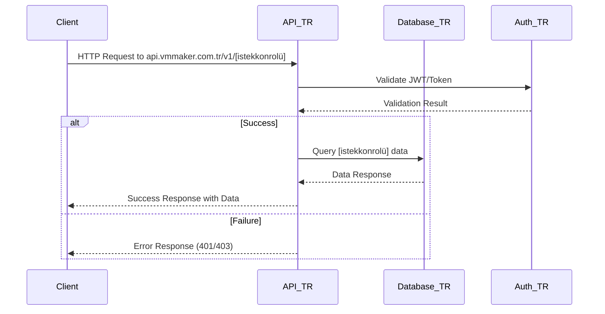

# VM Maker | Revolutionary IoT API Solution for ESP32

```mermaid
sequenceDiagram
    participant Client
    participant API_TR
    participant Database_TR
    participant Auth_TR

    Client->>API_TR: HTTP Request to api.vmmaker.com.tr/v1/[istekkonrolü]
    API_TR->>Auth_TR: Validate JWT/Token
    Auth_TR-->>API_TR: Validation Result
    alt Success
        API_TR->>Database_TR: Query [istekkonrolü] data
        Database_TR-->>API_TR: Data Response
        API_TR-->>Client: Success Response with Data
    else Failure
        API_TR-->>Client: Error Response (401/403)
    end
```
