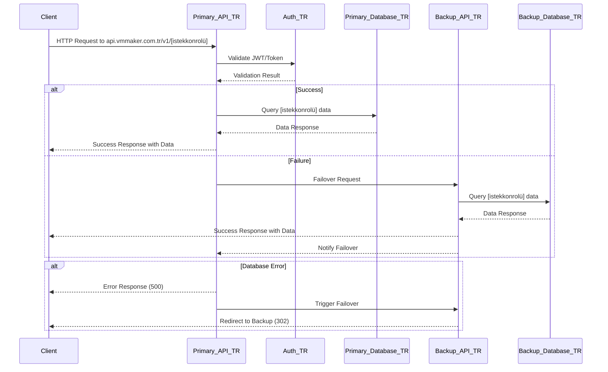

# VM Maker | Revolutionary IoT API Solution for ESP32

```mermaid
sequenceDiagram
    participant Client
    participant Primary_API_TR
    participant Auth_TR
    participant Primary_Database_TR
    participant Backup_API_TR
    participant Backup_Database_TR

    Client->>Primary_API_TR: HTTP Request to api.vmmaker.com.tr/v1/[istekkonrolü]
    Primary_API_TR->>Auth_TR: Validate JWT/Token
    Auth_TR-->>Primary_API_TR: Validation Result
    alt Success
        Primary_API_TR->>Primary_Database_TR: Query [istekkonrolü] data
        Primary_Database_TR-->>Primary_API_TR: Data Response
        Primary_API_TR-->>Client: Success Response with Data
    else Failure
        Primary_API_TR->>Backup_API_TR: Failover Request
        Backup_API_TR->>Backup_Database_TR: Query [istekkonrolü] data
        Backup_Database_TR-->>Backup_API_TR: Data Response
        Backup_API_TR-->>Client: Success Response with Data
        Backup_API_TR-->>Primary_API_TR: Notify Failover
    end
    alt Database Error
        Primary_API_TR-->>Client: Error Response (500)
        Primary_API_TR->>Backup_API_TR: Trigger Failover
        Backup_API_TR-->>Client: Redirect to Backup (302)
    end
```
