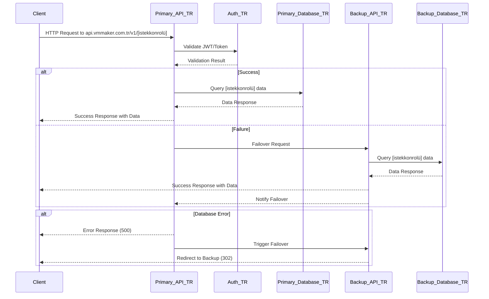
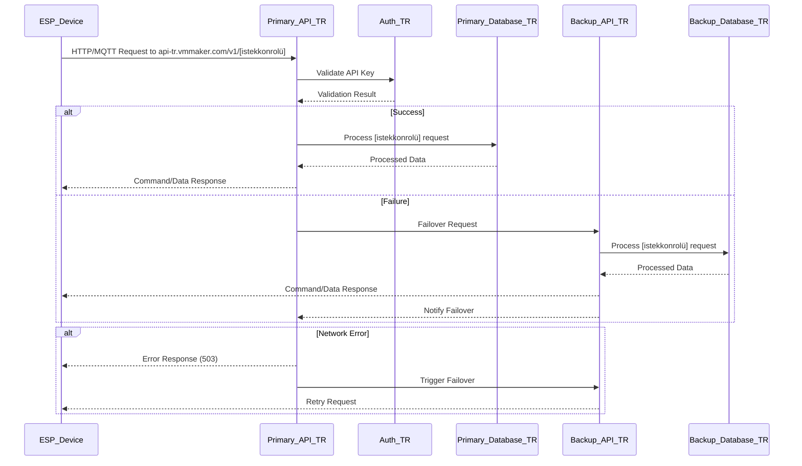
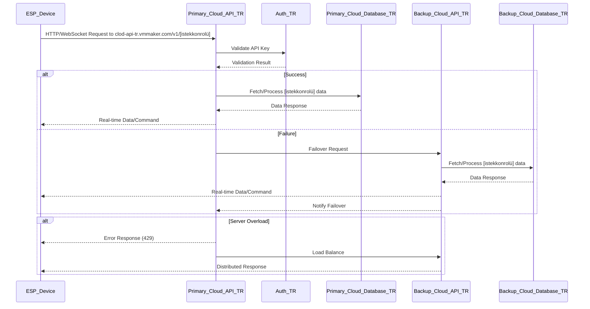
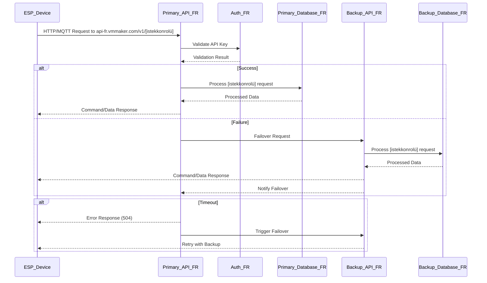
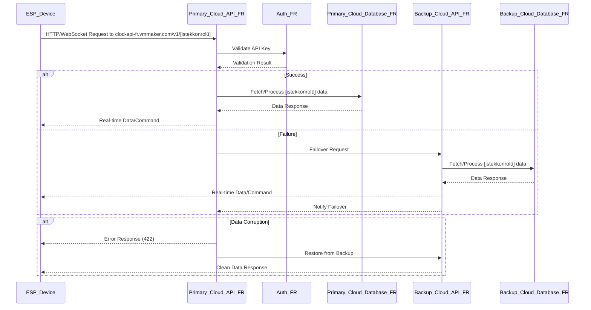
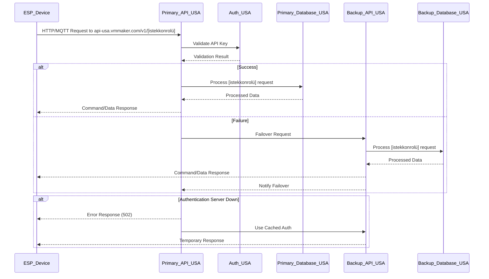
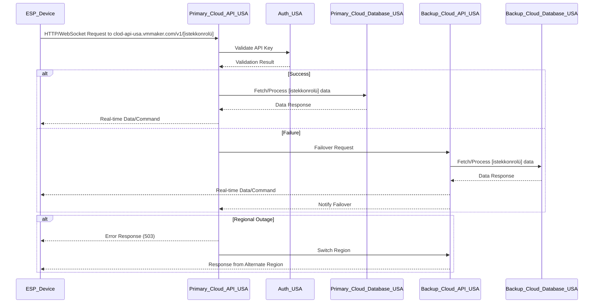
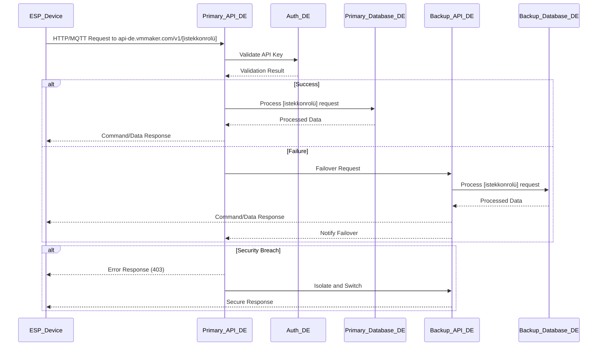

# VM Maker | Revolutionary IoT API Solution for ESP32

## ESP32 API Server

This section details the API server workflows for ESP32 devices across different regions and use cases, including primary systems, backup systems, failover mechanisms, and detailed error handling.

### TR (Kendi Sistemleri için - api.vmmaker.com.tr)
This flow represents the request control process for user systems using `api.vmmaker.com.tr`.

- **Details**: Primary API (`Primary_API_TR`) handles requests with JWT validation. If primary fails, `Backup_API_TR` takes over with synchronized `Backup_Database_TR`. Failover triggers a 302 redirect.

---

### TR (ESP/Sistem için - api-tr.vmmaker.com/v1/[istekkonrolü])
This flow represents the request control process for ESP32 devices using `api-tr.vmmaker.com`.

- **Details**: ESP devices use API keys for authentication. `Backup_API_TR` provides failover with synchronized data. Network errors trigger a 503 and retry via backup.

---

### TR (ESP/Sistem için - clod-api-tr.vmmaker.com/v1/[istekkonrolü])
This flow represents the cloud-based request control for ESP32 devices using `clod-api-tr.vmmaker.com`.

- **Details**: Cloud API supports real-time WebSocket. `Backup_Cloud_API_TR` handles failover and load balancing with a 429 response for overloads.

---

### FR (ESP/Sistem için - api-fr.vmmaker.com/v1/[istekkonrolü])
This flow represents the request control for ESP32 devices in France using `api-fr.vmmaker.com`.

- **Details**: Failover to `Backup_API_FR` on timeout (504). Data synchronization ensures continuity.

---

### FR (ESP/Sistem için - clod-api-fr.vmmaker.com/v1/[istekkonrolü])
This flow represents the cloud-based request control for ESP32 devices in France.

- **Details**: Handles data corruption with a 422 response and restores from `Backup_Cloud_API_FR`.

---

### USA (ESP/Sistem için - api-usa.vmmaker.com/v1/[istekkonrolü])
This flow represents the request control for ESP32 devices in the USA.

- **Details**: Handles authentication server failure with a 502 and cached authentication via backup.

---

### USA (ESP/Sistem için - clod-api-usa.vmmaker.com/v1/[istekkonrolü])
This flow represents the cloud-based request control for ESP32 devices in the USA.

- **Details**: Manages regional outages with a 503 and regional switching to `Backup_Cloud_API_USA`.

---

### DE (ESP/Sistem için - api-de.vmmaker.com/v1/[istekkonrolü])
This flow represents the request control for ESP32 devices in Germany.

- **Details**: Handles security breaches with a 403 and isolates to `Backup_API_DE`.

---

### DE (ESP/Sistem için - clod-api-de.vmmaker.com/v1/[istekkonrolü])
This flow represents the cloud-based request control for ESP32 devices in Germany.

- **Details**: Manages maintenance mode with a 503 and switches to `Backup_Cloud_API_DE`.
--
